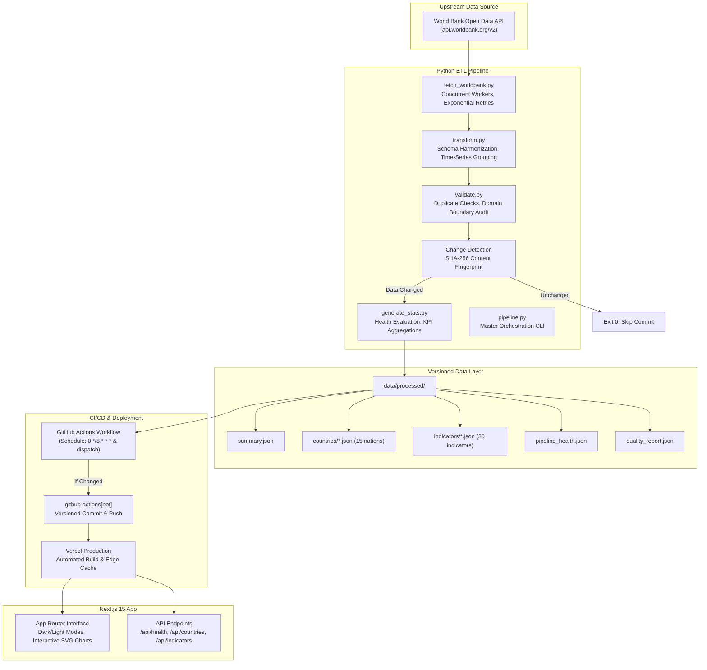

# Global Development Pulse

[](https://nextjs.org/)
[](https://www.typescriptlang.org/)
[](https://www.python.org/)
[](https://github.com/)
[](https://tailwindcss.com/)
[](https://opensource.org/licenses/MIT)

> **Automated global development data, refreshed continuously.**
> 
> *Global Development Pulse is an independent open-data visualization project using data from the World Bank. Not affiliated with or endorsed by the World Bank Group.*

---

## Overview

**Global Development Pulse** is an automated global development data platform that collects, validates, transforms, versions, and visualizes public development indicators. 

Unlike static mock dashboards, Global Development Pulse functions as an autonomous, self-maintaining data platform:
1. Every **8 hours**, a scheduled GitHub Actions workflow launches a multi-threaded Python ETL pipeline.
2. The pipeline queries the **World Bank Open Data API** across 15 nations and 30 indicators from 2000 to 2024.
3. Observations undergo multi-layer schema verification, duplicate detection, and domain sanity checks.
4. **Deterministic Change Detection** computes a cryptographic SHA-256 fingerprint of underlying values. If no data has changed, commits are strictly skipped.
5. When real data changes occur, updated datasets are committed to Git by `github-actions[bot]`, automatically triggering an updated production deployment on Vercel.

---

## Live Demo & Architecture

- **Production URL:** [[https://global-development-pulse.vercel.app](https://global-development-pulse-two.vercel.app/)]
- **Interactive Pages:**
  - `/` — Global KPI metrics, featured digital connectivity trend, tracked economies snapshot.
  - `/countries` — Searchable directory with region and income group filters.
  - `/countries/[country]` — Dedicated country profile with 6 indicator categories and interactive historical charts.
  - `/compare` — Cross-country comparative engine for 2–5 nations with CSV export.
  - `/indicators` — Registry of 30 standardized indicators across 6 development pillars.
  - `/indicators/[indicator]` — Indicator deep-dive with global distribution and rankings.
  - `/pipeline` — Real-time pipeline health, live audit reports, and architecture diagnostics.
  - `/methodology` — Technical transparency, zero-imputation policy, and API attribution.

### Architecture Diagram



---

## Monitored Countries (15)

The platform is designed with a centralized configuration registry (`scripts/config.py` and `src/types/index.ts`). Adding new countries requires zero code modifications:

| Country | ISO-3 | Region | Income Group | Capital |
| :--- | :--- | :--- | :--- | :--- |
| **Pakistan** | `PAK` | South Asia | Lower middle income | Islamabad |
| **India** | `IND` | South Asia | Lower middle income | New Delhi |
| **Bangladesh** | `BGD` | South Asia | Lower middle income | Dhaka |
| **Sri Lanka** | `LKA` | South Asia | Lower middle income | Colombo |
| **Nepal** | `NPL` | South Asia | Lower middle income | Kathmandu |
| **United Arab Emirates** | `ARE` | Middle East & North Africa | High income | Abu Dhabi |
| **Saudi Arabia** | `SAU` | Middle East & North Africa | High income | Riyadh |
| **United Kingdom** | `GBR` | Europe & Central Asia | High income | London |
| **United States** | `USA` | North America | High income | Washington, D.C. |
| **Canada** | `CAN` | North America | High income | Ottawa |
| **Germany** | `DEU` | Europe & Central Asia | High income | Berlin |
| **France** | `FRA` | Europe & Central Asia | High income | Paris |
| **Japan** | `JPN` | East Asia & Pacific | High income | Tokyo |
| **Australia** | `AUS` | East Asia & Pacific | High income | Canberra |
| **China** | `CHN` | East Asia & Pacific | Upper middle income | Beijing |

---

## Monitored Indicators (30)

Organized across 6 core international development pillars:

1. **Economic:**
   - GDP (Current US$) — `NY.GDP.MKTP.CD`
   - GDP per Capita (Current US$) — `NY.GDP.PCAP.CD`
   - GDP Growth (Annual %) — `NY.GDP.MKTP.KD.ZG`
   - Inflation, Consumer Prices (Annual %) — `FP.CPI.TOTL.ZG`
   - Exports of Goods and Services (% of GDP) — `NE.EXP.GNFS.ZS`
   - Imports of Goods and Services (% of GDP) — `NE.IMP.GNFS.ZS`
   - Foreign Direct Investment, Net Inflows (% of GDP) — `BX.KLT.DINV.WD.GD.ZS`
2. **Population:**
   - Total Population — `SP.POP.TOTL`
   - Population Growth (Annual %) — `SP.POP.GROW`
   - Urban Population (% of Total) — `SP.URB.TOTL.IN.ZS`
   - Life Expectancy at Birth (Years) — `SP.DYN.LE00.IN`
   - Crude Birth Rate (per 1,000 People) — `SP.DYN.CBRT.IN`
   - Crude Death Rate (per 1,000 People) — `SP.DYN.CDRT.IN`
3. **Employment:**
   - Unemployment Rate (% of Labor Force) — `SL.UEM.TOTL.ZS`
   - Labor Force Participation Rate (% Ages 15+) — `SL.TLF.CACT.ZS`
   - Employment to Population Ratio (% Ages 15+) — `SL.EMP.TOTL.SP.ZS`
4. **Education:**
   - Primary School Enrollment (% Gross) — `SE.PRM.ENRR`
   - Secondary School Enrollment (% Gross) — `SE.SEC.ENRR`
   - Government Expenditure on Education (% of GDP) — `SE.XPD.TOTL.GD.ZS`
   - Adult Literacy Rate (% Ages 15+) — `SE.ADT.LITR.ZS`
5. **Digital & Connectivity:**
   - Individuals Using the Internet (% of Population) — `IT.NET.USER.ZS`
   - Mobile Cellular Subscriptions (per 100 People) — `IT.CEL.SETS.P2`
   - Secure Internet Servers (per Million People) — `IT.NET.SECR.P6`
6. **Environment & Energy:**
   - Forest Area (% of Land Area) — `AG.LND.FRST.ZS`
   - Renewable Electricity Output (% of Total) — `EG.ELC.RNEW.ZS`
   - Renewable Energy Consumption (% of Total) — `EG.FEC.RNEW.ZS`
   - Energy Use (kg of Oil Equivalent per Capita) — `EG.USE.PCAP.KG.OE`
   - Access to Electricity (% of Population) — `EG.ELC.ACCS.ZS`
   - Electric Power Consumption (kWh per Capita) — `EG.USE.ELEC.KH.PC`
   - Agricultural Land (% of Land Area) — `AG.LND.AGRI.ZS`

---

## Data Pipeline Mechanics

### 1. Ingestion & Batching
The pipeline uses concurrent worker pools (`ThreadPoolExecutor`) and multi-country query batching:
```python
url = "https://api.worldbank.org/v2/country/PAK;IND;USA;.../indicator/{code}?date=2000:2024&format=json&per_page=1000"
```
All 30 indicators across 15 nations (11,250 records) are fetched and processed in ~28 seconds.

### 2. Validation & Quality Audit
`validate.py` executes multi-layer checks:
- Required schema properties (12 core fields).
- Strict duplicate detection on `(country_code, indicator_code, year)`.
- Domain boundary validation (e.g. percentages within $[0, 100]$, life expectancy $\in [20, 115]$, positive GDP).
- Emits `quality_report.json` with counts of records, missing data, and error samples.

### 3. Change Detection & Zero-Spam Commits
To keep GitHub history meaningful and avoid empty commits:
- A SHA-256 fingerprint is calculated across all `(indicator, country, year, value)` tuples.
- If identical to the recorded fingerprint in `.records_hash`, the pipeline logs `PIPELINE_STATUS: UNCHANGED` and terminates with exit code 0.
- GitHub Actions detects that no files in `data/processed/` were modified and skips committing.

---

## Local Development Setup

### Prerequisites
- Node.js 18+ (tested on Node 24)
- Python 3.10+ (tested on Python 3.14)
- Git

### 1. Clone & Install Dependencies
```bash
git clone https://github.com/your-username/global-development-pulse.git
cd global-development-pulse

# Install Next.js frontend dependencies
npm install

# Setup Python virtual environment
python -m venv .venv

# On Windows:
.venv\Scripts\activate
# On Linux/macOS:
# source .venv/bin/activate

# Install Python ETL dependencies
pip install -r requirements.txt
```

### 2. Run ETL Tests & Pipeline
```bash
# Run unit test suite
npm run test
# or: python -m unittest discover -s tests -p "test_*.py"

# Run master data pipeline
npm run pipeline
# or force regeneration:
npm run pipeline:force
```

### 3. Launch Development Server
```bash
npm run dev
```
Open [http://localhost:3000](http://localhost:3000) in your browser.

---

## Deployment (Vercel + GitHub Actions)

### 1. Deploying to Vercel
1. Push this repository to GitHub.
2. Log into [Vercel](https://vercel.com/) and click **New Project**.
3. Import the repository. Framework preset **Next.js** is automatically detected.
4. Leave build command as `next build`. All processed data is already versioned in `data/processed/`.
5. Deploy.

### 2. Enabling Automated Refresh
The workflow in `.github/workflows/refresh-data.yml` runs automatically:
- On cron: `0 */8 * * *` (every 8 hours)
- Manually via **Actions &rarr; Refresh World Bank Data &rarr; Run workflow**
- Uses GitHub's built-in `GITHUB_TOKEN` with `contents: write` permissions. Zero third-party secrets required.

---

## Limitations & Honesty

- **Annual Reporting Delay:** World Bank indicators are derived from national statistical offices and carry an inherent 1–2 year reporting lag. Data is refreshed every 8 hours to capture new World Bank releases, but underlying figures represent annual snapshots.
- **Missing Observations:** Certain indicators (such as adult literacy surveys or national education budgets) are collected periodically rather than annually. We do **not** impute or falsify missing data.
- **Descriptive Stance:** Development metrics are presented descriptively without subjective &ldquo;good&rdquo; or &ldquo;bad&rdquo; labels.

---

## License

This project is open-source under the [MIT License](LICENSE).  
World Bank data is provided under the [Creative Commons Attribution 4.0 International License (CC BY 4.0)](https://datacatalog.worldbank.org/public-licenses#cc-by).
